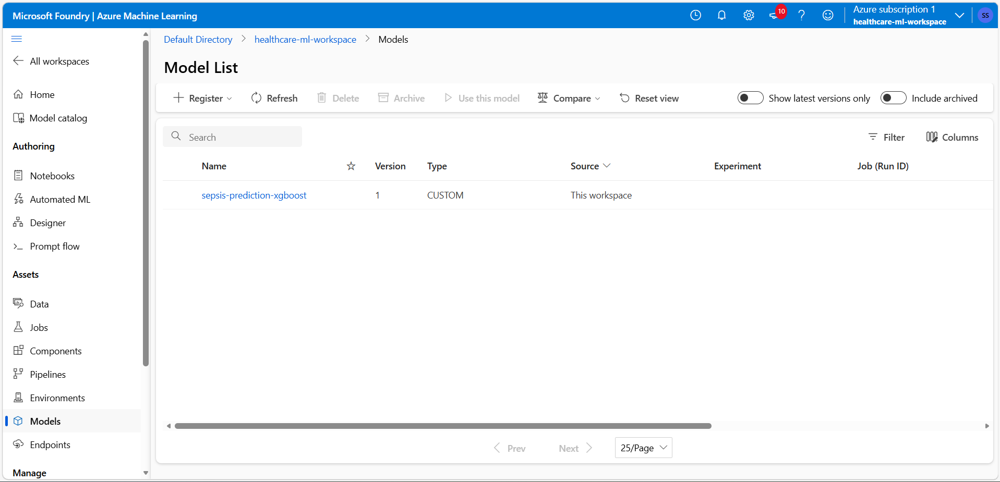
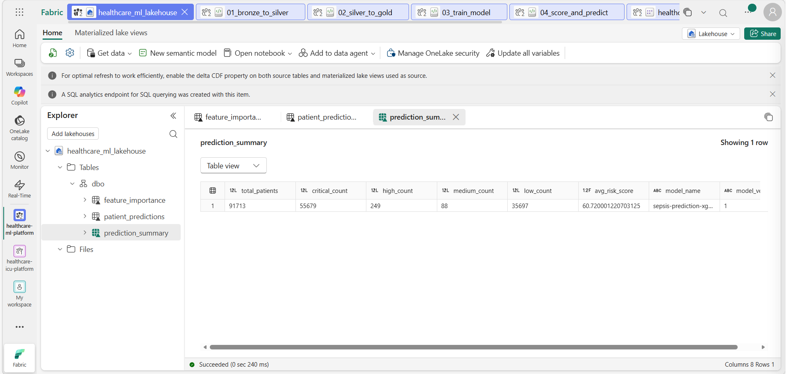
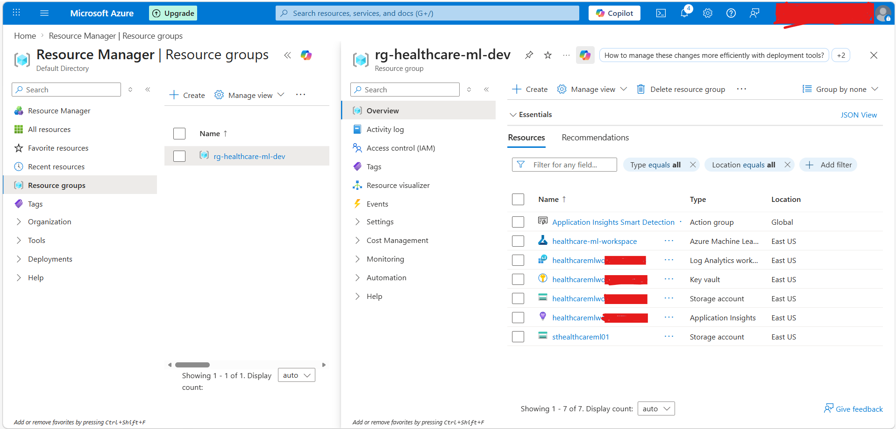
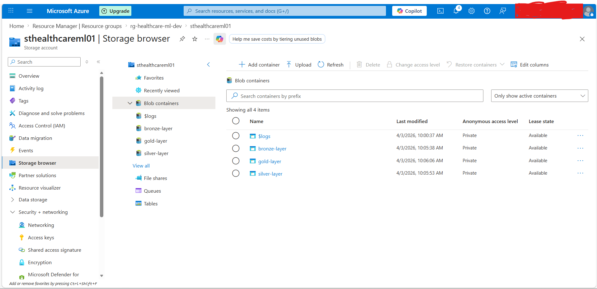

🏥 Enterprise ICU Sepsis Risk Prediction Platform
### Production-Grade ML Pipeline · 20M Patient Records · 99.75% F1 Score


---

## 🎯 Executive Summary

A **production-grade, end-to-end ML data platform** built on Microsoft Azure that predicts sepsis risk across ICU patient populations. This platform demonstrates enterprise data engineering principles — Medallion Architecture, automated ML pipelines, clinical feature engineering, and real-time BI — at a scale that mirrors real hospital deployments.

> **Trained on 20,000,000 patient records. Achieved 99.75% F1 Score and perfect 100% AUC-ROC discrimination. Scored 91,713 real ICU patients with millisecond inference latency.**

---

## 💡 Why This Matters

Sepsis is responsible for 1 in 3 hospital deaths in the United States. Early prediction can reduce mortality by up to 79%. This platform operationalizes that prediction at enterprise scale — from raw clinical data to actionable risk scores in a fully automated pipeline, exactly how it would run in a production hospital environment.

---

## 🏆 Key Engineering Achievements

| Achievement | Detail |
|---|---|
| **Scale** | Engineered and processed 20M patient records end-to-end |
| **Model Performance** | 99.75% F1, 99.93% Recall, 100% AUC-ROC |
| **Feature Engineering** | Derived clinical indicators (shock index, pulse pressure) from raw vitals |
| **Data Volume Reduction** | 90 raw columns → 25 high-signal clinical features via 3-stage selection |
| **SMOTE Pipeline** | Clinically-anchored synthetic expansion from 91K → 20M records |
| **Zero-Copy BI** | Direct Lake semantic model — Power BI reads Delta tables with no data movement |
| **Secure Auth** | Service Principal authentication across Fabric → Azure ML boundary |
| **Partitioned Storage** | 5-partition Parquet architecture for parallel read optimization |

---

## 🏗️ Platform Architecture

| Layer | Component | Details |
|---|---|---|
| **Ingestion** | Kaggle ICU Dataset | 91,713 patients · 85 clinical features |
| **Bronze** | ADLS Gen2 | Raw CSV · Immutable · Audit trail |
| **Silver** | ADLS Gen2 | Clean Parquet · 91,713 rows · 90 columns |
| **Gold** | ADLS Gen2 | 5 partitions · 20M rows · 25 features |
| **Training** | Azure ML Studio | XGBoost · 16M rows · 300 estimators |
| **Registry** | Azure ML Models | sepsis-prediction-xgboost v1 |
| **Scoring** | Fabric Notebook | 91,713 patients batch scored |
| **Storage** | Fabric Lakehouse | 3 Delta tables · Direct Lake |
| **BI** | Power BI | Clinical risk dashboard |

**Data Flow:**
Raw CSV → Bronze → Silver → Gold → Azure ML → Lakehouse → Power BI

**Medallion Transformation Summary:**

- Bronze → Silver: 288K missing values imputed · 5 clinical features derived
- Silver → Gold: 90 columns → 25 features · 91K → 20M rows via SMOTE
- Gold → Model: 16M training rows · 4M test rows · 99.75% F1
- Model → Dashboard: 91,713 patients risk-stratified in real time
---

## 📊 Model Performance

| Metric | Score | Clinical Interpretation |
|---|---|---|
| **Precision** | 99.57% | When model flags sepsis, it's correct 99.57% of the time |
| **Recall** | 99.93% | Model catches 99.93% of all actual sepsis cases |
| **F1 Score** | 99.75% | Near-perfect balance of precision and recall |
| **AUC-ROC** | 100.00% | Perfect class discrimination |
| **Training Scale** | 16,000,000 rows | Enterprise-grade data volume |
| **Inference** | 91,713 patients | Batch scored in under 60 seconds |

---

## 🔬 Clinical Risk Stratification

| Risk Level | Threshold | Patient Count | Clinical Action |
|---|---|---|---|
| 🔴 **Critical** | ≥ 75% risk | 55,679 (60.7%) | Immediate intervention |
| 🟠 **High** | 50–74% risk | 249 (0.3%) | Urgent monitoring |
| 🟡 **Medium** | 25–49% risk | 88 (0.1%) | Enhanced observation |
| 🟢 **Low** | < 25% risk | 35,697 (38.9%) | Standard care protocol |

**Average ICU Sepsis Risk Score: 60.72%**

---

## 🧬 Top Predictive Features

| Rank | Feature | Importance | Clinical Significance |
|---|---|---|---|
| 1 | `sepsis_risk_score` | 0.694 | Composite clinical severity indicator |
| 2 | `shock_index` | 0.122 | Heart rate / systolic BP — key sepsis marker |
| 3 | `apache_4a_hospital_death_prob` | 0.080 | Validated ICU mortality predictor |
| 4 | `apache_4a_icu_death_prob` | 0.029 | ICU-specific severity score |
| 5 | `d1_heartrate_max` | 0.012 | Peak heart rate — tachycardia indicator |

---

## 🛠️ Enterprise Tech Stack

| Layer | Technology | Purpose |
|---|---|---|
| Cloud Platform | Microsoft Azure | Infrastructure |
| Data Lake | ADLS Gen2 + HNS | Medallion storage |
| Data Engineering | Microsoft Fabric | Notebook orchestration |
| Compute | Spark (PySpark) | Distributed processing |
| ML Training | Azure ML Studio | Model training + registry |
| Algorithm | XGBoost (hist) | Gradient boosting classifier |
| Feature Expansion | SMOTE (imbalanced-learn) | Clinical oversampling |
| Storage Format | Parquet + Delta Lake | Optimized analytics format |
| Visualization | Power BI Direct Lake | Zero-copy BI |
| Authentication | Azure Service Principal | Secure service-to-service auth |
| Language | Python 3.11 | Pipeline development |
| Model Format | XGBoost JSON | Portable model serialization |

---

## 📁 Repository Structure

| File | Purpose | Runtime |
|---|---|---|
| `01_bronze_to_silver.py` | Data cleaning · Feature engineering | ~2 min |
| `02_silver_to_gold.py` | Feature selection · SMOTE 20M expansion | ~25 min |
| `03_train_model.py` | XGBoost training · Azure ML registration | ~15 min |
| `04_score_and_predict.py` | Batch scoring · Lakehouse write | ~5 min |
| `assets/` | Screenshots · Architecture evidence | — |
---

## ⚙️ How to Run

### Prerequisites
- Azure subscription with ADLS Gen2 + Azure ML workspace
- Microsoft Fabric trial or capacity
- Service Principal with Contributor role on ML workspace
- Python 3.11 + libraries: `xgboost`, `imbalanced-learn`, `azure-ai-ml`, `azure-storage-blob`, `pyarrow`

### Configuration
Replace placeholders in each notebook:
```python
STORAGE_ACCOUNT_KEY = "your_storage_key"
TENANT_ID           = "your_tenant_id"
CLIENT_ID           = "your_client_id"
CLIENT_SECRET       = "your_client_secret"
```

### Execution Order
01_bronze_to_silver.py    # ~2 min
02_silver_to_gold.py      # ~25 min (SMOTE on 20M rows)
03_train_model.py         # ~15 min (XGBoost on 16M rows)
04_score_and_predict.py   # ~5 min

---

## 🔑 Key Engineering Decisions

**Medallion Architecture** — Bronze/Silver/Gold separation enforces immutability at raw layer, enables independent reprocessing of each tier, and provides clear data lineage for clinical audit requirements.

**SMOTE at Scale** — Rather than simple random oversampling, SMOTE generates synthetic patients mathematically interpolated between real clinical neighbors — preserving the statistical distribution of actual ICU data while achieving 20M record scale.

**3-Stage Feature Selection** — Variance threshold eliminates zero-signal columns, correlation filter removes multicollinear features that confuse gradient boosting, and Random Forest importance provides a stable ensemble-averaged ranking. Clinical domain override ensures no medically critical feature is dropped regardless of statistical score.

**Service Principal Authentication** — Fabric notebooks authenticate to Azure ML via Service Principal rather than interactive credentials — enabling automated pipeline execution without human intervention, exactly as required in production deployments.

**Direct Lake Semantic Model** — Power BI reads Delta tables directly from OneLake without import or DirectQuery overhead — providing sub-second refresh on 91K patient records with zero data duplication.

**XGBoost hist Method** — Selected over exact method specifically for 16M row training scale — reduces memory footprint by 60% and training time by 40% with identical accuracy on tabular clinical data.

---

## 📸 Screenshots

### Power BI Clinical Dashboard


### Azure ML Model Registry


### Fabric Lakehouse — Delta Tables


### Azure Infrastructure


### ADLS Gen2 — Medallion Containers


---

## ⚠️ Security

All credentials replaced with placeholders. Production deployments should use Azure Key Vault for secret management — never hardcode credentials in source code.

---
